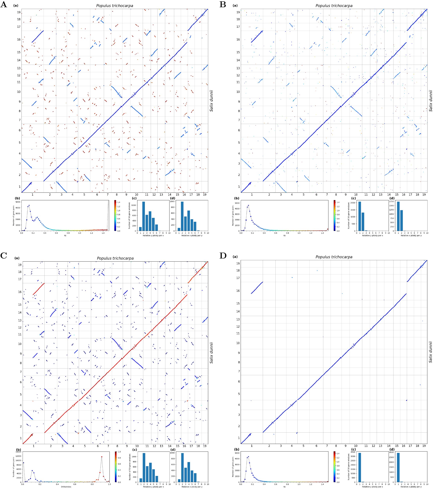

[](https://github.com/zhangrengang/soi/actions/workflows/main-linux.yml)
[](https://github.com/zhangrengang/soi/actions/workflows/main-mac.yml)

## Table of Contents

   * [Quick start](#Quick-start)
   * [Introduction](#introduction)
   * [Installation](#Installation)
      - [conda](#conda)
      - [Apptainer/Singularity](#apptainersingularity)
   * [Subcommands](#Subcommands)
      - [filter](#filter)
      - [cluster](#cluster)
      - [outgroup](#outgroup)
      - [phylo](#phylo)
      - [dotplot](#dotplot)
      - [Other functions](#other-functions)
   * [Phylogenomics pipeline](#Phylogenomics-pipeline)
   * [Input formats](#input-formats)
   * [Output formats](#output-formats)
   * [Citation](#citation)
## Quick start ##
```
git clone https://github.com/zhangrengang/orthoindex.git
cd orthoindex

# install
conda env create -f OrthoIndex.yaml
conda activate OrthoIndex
python3 setup.py install

# test
cd example_data/
sh example.sh

# example.sh:
# dot plots
# A
soi dotplot -s Populus_trichocarpa-Salix_dunnii.collinearity.gz \
        -g Populus_trichocarpa-Salix_dunnii.gff.gz -c Populus_trichocarpa-Salix_dunnii.ctl  \
        --kaks Populus_trichocarpa-Salix_dunnii.collinearity.ks.gz \
        --xlabel '$Populus\ trichocarpa$' --ylabel '$Salix\ dunnii$' \
        --ks-hist --max-ks 1.5 -o Populus_trichocarpa-Salix_dunnii     \
        --plot-ploidy --gene-axis --number-plots
# B
soi dotplot -s Populus_trichocarpa-Salix_dunnii.orthologs.gz    \
        -g Populus_trichocarpa-Salix_dunnii.gff.gz -c Populus_trichocarpa-Salix_dunnii.ctl  \
        --kaks Populus_trichocarpa-Salix_dunnii.collinearity.ks.gz \
        --xlabel '$Populus\ trichocarpa$' --ylabel '$Salix\ dunnii$'  \
        --ks-hist --max-ks 1.5 -o Populus_trichocarpa-Salix_dunnii.o   \
        --plot-ploidy --gene-axis --number-plots  \
        --homology      # homology input
# C
soi dotplot -s Populus_trichocarpa-Salix_dunnii.collinearity.gz \
        -g Populus_trichocarpa-Salix_dunnii.gff.gz -c Populus_trichocarpa-Salix_dunnii.ctl  \
        --xlabel '$Populus\ trichocarpa$' --ylabel '$Salix\ dunnii$' \
        --ks-hist -o Populus_trichocarpa-Salix_dunnii.io    \
        --plot-ploidy --gene-axis --number-plots \
        --ofdir OrthoFinder/OrthoFinder/Results_*/ --of-color   # coloring by Orthology Index
# D
soi dotplot -s Populus_trichocarpa-Salix_dunnii.collinearity.gz \
        -g Populus_trichocarpa-Salix_dunnii.gff.gz -c Populus_trichocarpa-Salix_dunnii.ctl  \
        --kaks Populus_trichocarpa-Salix_dunnii.collinearity.ks.gz \
        --xlabel '$Populus\ trichocarpa$' --ylabel '$Salix\ dunnii$' \
        --ks-hist --max-ks 1.5 -o Populus_trichocarpa-Salix_dunnii.io  \
        --plot-ploidy --gene-axis --number-plots \
        --ofdir OrthoFinder/OrthoFinder/Results_*/ --of-ratio 0.6       # filtering by Orthology Index


# filter orthologous synteny
soi filter -s Populus_trichocarpa-Salix_dunnii.collinearity.gz -o OrthoFinder/OrthoFinder/Results_*/ \
        -c 0.6 > Populus_trichocarpa-Salix_dunnii.collinearity.ortho.test
# or (alter input format)
soi filter -s Populus_trichocarpa-Salix_dunnii.collinearity.gz -o Populus_trichocarpa-Salix_dunnii.orthologs.gz \
        -c 0.6 > Populus_trichocarpa-Salix_dunnii.collinearity.ortho.test
# compare with the expected output: no output via `diff`
diff Populus_trichocarpa-Salix_dunnii.collinearity.ortho Populus_trichocarpa-Salix_dunnii.collinearity.ortho.test

```
**Note**: If you want to run the [full phylogenomic pipeline of SOI](https://github.com/zhangrengang/evolution_example/), 
GENE ID is needed to label with SPECIES ID (e.g. `Angelica_sinensis|AS01G00001`) for compatibility.
See [details how to prepare the data](https://github.com/zhangrengang/evolution_example/?tab=readme-ov-file#prepare-data).

### Example output dot plots ###

Figure. The Orthology Index in identifying orthologous synteny: a typical case. 
A) Ks-colored dot plots showing synteny detected by WGDI, 
with an observable distinction of three categories of syntenic blocks derived from three evolutionary events 
(three peaks: Ks ≈ 1.5, Ks ≈ 0.27, and Ks ≈ 0.13). 
B) Ks-colored dot plots illustrating orthology inferred by OrthoFinder2, with an observable high proportion of hidden out-paralogs (Ks ≈ 0.27). 
C) Orthology Index (OI)-colored dot plots: integrating synteny (A) and orthology (B), 
with polarized and scalable distinction of three categories of syntenic blocks 
(three peaks: OI ≈ 0, OI ≈ 0.1, and OI ≈ 0.9). 
D) Ks-colored dot plots of synteny after applying an OI cutoff of 0.6, 
with clean 1:1 orthology as expected from the evolutionary history. 
A-D are plotted using the `dotplot` subcommand with four subplots: 
a) dot plots with colored by Ks or OI (x-axis and y-axis, chromosomes of the two genomes; 
a dot indicates a homologous gene pair between the two genomes), 
b) histogram (with the same color map as the dot plots) of Ks or OI 
(x-axis, Ks or OI; y-axis, number of homologous gene pairs), 
c-d) synteny depth (relative ploidy) derived from 50-gene windows (x-axis, synteny depth; y-axis, number of windows).

## Introduction ##
Orthology Index (OrthoIndex or OI) incorporates algorithmic advances of two methods (orthology inference and synteny detection), to determine the orthology of a syntenic block. 
It is straightforward, representing the proportion of orthologous gene pairs within a syntenic block. 

## Installation ##
#### conda ####
You can install the environment and the lasest verion using [conda](https://anaconda.org/) or [mamba](https://github.com/mamba-org/mamba):
```
git clone https://github.com/zhangrengang/orthoindex.git
cd orthoindex

conda env create -f OrthoIndex.yaml
conda activate OrthoIndex
python3 setup.py install
soi -h
```
Alternatviely, the released version can be installed through [conda](https://anaconda.org/) or [mamba](https://github.com/mamba-org/mamba):
```
mamba create -n OrthoIndex
mamba install -n OrthoIndex -c mouseking9 -c conda-forge -c bioconda  orthoindex
mamba activate OrthoIndex
soi -h
```
#### Apptainer/Singularity ####
To use the container, you need to have installed [Apptainer](https://apptainer.org/docs/user/latest/index.html) or 
[Singularity](https://sylabs.io/docs/). 
Then you can download the container image and run:
```
apptainer remote add --no-login SylabsCloud cloud.sylabs.io
apptainer remote use SylabsCloud
apptainer pull orthoindex.sif library://shang-hongyun/collection/orthoindex:1.2.0
./orthoindex.sif soi -h
```
The image can be found [here](https://cloud.sylabs.io/library/shang-hongyun/collection/orthoindex).

## Subcommands ##
```
$ soi -h
usage: soi [-h] {dotplot,filter,cluster,outgroup,phylo,stats} ...

Play with Orthology Index

positional arguments:
  {dotplot,filter,cluster,outgroup,phylo,stats}
                        sub-command help
    dotplot             Generate colored dot plots
    filter              Filter synteny with Orthology Index (standard output)
    cluster             Cluster syntenic orthogroups (SOGs)
    outgroup            Add outgroups for SOGs from synteny
    phylo               Build gene trees from SOGs
    stats               Make statistics of SOGs for phylogeny

optional arguments:
  -h, --help            show this help message and exit
```
#### `filter` ####
The subcommand `filter` filters orthologous blocks with a default minimum index of 0.6:
```
$ soi filter -h
usage: soi filter [-h] -s [FILE [FILE ...]] -o [FOLDER/FILE [FOLDER/FILE ...]] [-c FLOAT] [-u FLOAT] [-n INT] [-g FILE] [-d INT] [-stat OUT_STATS] [-oo]

optional arguments:
  -h, --help            show this help message and exit
  -s [FILE [FILE ...]], -synteny [FILE [FILE ...]]
                        Collinearity files output from MCscanX, WGDI, or MCscan/JCVI. [required]
  -o [FOLDER/FILE [FOLDER/FILE ...]], -orthology [FOLDER/FILE [FOLDER/FILE ...]]
                        Orthologues output from OrthoFinder (folder), or OrthoMCL (file). [required]
  -c FLOAT, -cutoff FLOAT
                        Cutoff (lower limit) of Orthology Index [default=0.6]
  -u FLOAT, -upper FLOAT
                        Upper limit of Orthology Index [default=1]
  -n INT, -min_n INT    Minimum gene number in a block [default=0]
  -g FILE, -gff FILE    Gff file. [required for `-d`]
  -d INT, -min_dist INT
                        Minimum distance to remove a tandem repeated block [default=None]
  -stat OUT_STATS       Output stats by species pairs. [default=None]
  -oo                   Output retained orthology instead of synteny. [default=False]
```
Usage examples:
```
# from outputs of WGDI and OrthoFinder
soi filter -s wgdi/*.collinearity -o OrthoFinder/OrthoFinder/Result*/ > collinearity.ortho

# from outputs of MCscanX and OrthoMCL
soi filter -s mcscanx/*.collinearity -o pairs/orthologs.txt > collinearity.ortho

# from a list file and decrease the cutoff
ls wgdi/*.collinearity > collinearity.list
soi filter -s collinearity.list -o OrthoFinder/OrthoFinder/Result*/ -c 0.5 > collinearity.ortho

# filter a out-paralogous peak
soi filter -s wgdi/*.collinearity -o OrthoFinder/OrthoFinder/Result*/ -c 0.05 -upper 0.4 > collinearity.para

# remove intra-species, tandem repeat-derived synteny
soi filter -s wgdi/*.collinearity -o OrthoFinder/OrthoFinder/Result*/ -gff all_species_gene.gff -d 200 > collinearity.homo

```
#### `cluster` ####
The subcommand ‘cluster’ groups orthologous syntenic genes into syntenic orthogroups (SOGs), through constructing an orthologous syntenic graph 
and applying the Markov Cluster (MCL) algorithm to perform graph clustering and break weak links. 
```
$ soi cluster -h
usage: soi cluster [-h] -s [FILE [FILE ...]] [-o [FOLDER/FILE [FOLDER/FILE ...]]] [-I FLOAT] [-outgroup [TAXON/FILE [TAXON/FILE ...]]] [-ingroup [TAXON/FILE [TAXON/FILE ...]]]
                   [-prefix OUTPRE]

optional arguments:
  -h, --help            show this help message and exit
  -s [FILE [FILE ...]], -synteny [FILE [FILE ...]]
                        Collinearity files from `filter` sub-command. [required]
  -o [FOLDER/FILE [FOLDER/FILE ...]], -orthology [FOLDER/FILE [FOLDER/FILE ...]]
                        Orthologues output from OrthoFinder (folder), or OrthoMCL (file). This will use Orthology Index as weight for MCL [default=None]
  -I FLOAT, -inflation FLOAT
                        Inflation for MCL (varying this parameter affects granularity) [default=1.5]
  -outgroup [TAXON/FILE [TAXON/FILE ...]]
                        Outgroups to exclude from orthogroups (prior to `-ingroup`) [default=None]
  -ingroup [TAXON/FILE [TAXON/FILE ...]]
                        Ingroups that are only included [default=None]
  -prefix OUTPRE        Output prefix [default=cluster]
```
Usage examples:
```
# all species to include
soi cluster -s collinearity.ortho -prefix cluster

# exclude outgroup species that do not share the INGROUP-specific WGD event
soi cluster -s collinearity.ortho -outgroup XXX YYY
```
The defualt output file is `cluster.mcl`, with the orthogroup format of legacy OrthoMCL.

#### `outgroup` ####
The subcommand ‘outgroup’ retrieves syntenic orthologs from outgroups that lack WGDs shared with ingroups. 
```
$ soi outgroup -h
usage: soi outgroup [-h] -s [FILE [FILE ...]] -og FILE -outgroup [TAXON [TAXON ...]] [-cutoff FLOAT]

optional arguments:
  -h, --help            show this help message and exit
  -s [FILE [FILE ...]], -synteny [FILE [FILE ...]]
                        Collinearity files from `filter` sub-command. [required]
  -og FILE, -orthogroup FILE
                        Orthogroups output from `cluster` sub-command. [required]
  -outgroup [TAXON [TAXON ...]]
                        Outgroups to include to orthogroups [required]
  -cutoff FLOAT         Cutoff (lower limit) of links to outgroup genes [default=0.2]
```
Usage examples:
```
# If outgroups are excluded in the last `cluster` step:
soi outgroup -s collinearity.ortho -og cluster.mcl -outgroup XXX YYY > cluster.mcl.plus
```

#### `phylo` ####
The subcommand ‘phylo’ reconstructs multi-copy or single-copy gene trees, 
by aligning protein sequences with MAFFT v7.481 (Standley and Katoh 2013), 
converting protein alignment to codon alignment with PAL2NAL v14 (Suyama et al. 2006), 
trimming alignments with trimAl v1.2 (Capella-Gutierrez et al. 2009) (parameter: -automated1) 
and reconstructing maximum-likelihood trees with IQ-TREE v2.2.0.3 (Minh et al. 2020). 
```
$ soi phylo -h
sage: soi phylo [-h] -og FILE -pep FILE [-cds FILE] [-both] [-root [TAXON [TAXON ...]]] [-pre STR] [-mm FLOAT] [-mc INT] [-sc]
                 [-ss FILE] [-fmt {orthomcl,orthofinder,mcscanx}] [-only_aln] [-concat] [-trimal_opts STR] [-iqtree_opts STR]
                 [-p INT] [-tmp FOLDER] [-clean]

optional arguments:
  -h, --help            show this help message and exit
  -og FILE, -orthogroup FILE
                        Orthogroups output from `cluster` or `outgroup` sub-commands. [required]
  -pep FILE             Protein fasta file. [required]
  -cds FILE             CDS fasta file. [default=None]
  -both                 To use both CDS and PEP to build gene trees. [default: only CDS when `-cds` is true]
  -root [TAXON [TAXON ...]], -outgroup [TAXON [TAXON ...]]
                        Outgroups to root gene trees [default=None]
  -pre STR, -prefix STR
                        Output prefix. [default=sog]
  -mm FLOAT, -max_missing FLOAT
                        To allow maximum ratio of missing species. [default=0.4]
  -mc INT, -max_copies INT
                        To limit a common maximum copy number for every species. [default=6]
  -sc, -singlecopy      Only retrieve singlecopy genes (=`-max_copies 1`). [default=None]
  -ss FILE, -spsd FILE  To limit a specific copy number for each species (format: 'TAXON<tab>NUMBER'). [default=None]
  -fmt {orthomcl,orthofinder,mcscanx}
                        Format of `-orthogroup` input. [default=orthomcl]
  -only_aln             Only aligning sequences, to skip trimal and iqtree. [default=None]
  -concat               To concatenate alignments for tools such as IQTREE (valid when `-singlecopy` is true). [default=None]
  -trimal_opts STR      TrimAl options. [default='-automated1']
  -iqtree_opts STR      IQ-TREE options. [default='']
  -p INT, -ncpu INT     Number of processors. [default=20]
  -tmp FOLDER, -tmpdir FOLDER
                        Temporary folder. [default=./tmp-8a639818-fb56-11ef-b568-4cd98fb9bbe7]
  -clean                Cleanup temporary folder. [default=None]
```
Usage examples:
```
# output multi-copy gene trees of both protein and CDS(-both); rooted with grape (-root)
soi phylo -og cluster.mcl.plus -pep pep.faa -cds cds.fa -both -root Vitis_vinifera -pre mc-sog -p 80

# output single-copy gene trees (-sc) and concatenated alignments (-concat) of both protein and CDS (-both); rooted with grape (-root)
soi phylo -og cluster.mcl.plus -pep pep.faa -cds cds.fa -both -root Vitis_vinifera -pre sc-sog -sc -concat -p 80

# output multi-copy gene trees of protein, allowing up to 50% taxa missing
soi phylo -og cluster.mcl.plus -pep pep.faa -mm 0.5
```

#### `dotplot` ####
The subcommand `dotplot` enables visualization and evaluation of synteny, 
with colored by the Orthology Index or Ks values.

```
$ soi dotplot -h
usage: soi dotplot [-h] -s FILE [FILE ...] -g FILE -c FILE [-o STR] [--format FORMAT] [--number-plots] [--min-block INT]
                   [--min-dist INT] [--cluster] [--diagonal] [--gene-axis] [--xlines FILE] [--ylines FILE] [--xbars FILE]
                   [--ybars FILE] [--xbarlab] [--ybarlab] [--xlabel XLABEL] [--ylabel YLABEL] [--figsize NUM [NUM ...]]
                   [--fontsize NUM] [--dotsize NUM] [--ofdir FOLDER/FILE [FOLDER/FILE ...]] [--of-ratio FLOAT] [--of-color]
                   [--kaks FILE] [--ks-hist] [--max-ks Ks] [--ks-cmap Ks [Ks ...]] [--ks-step Ks] [--use-median] [--method STR]
                   [--lower-ks Ks] [--upper-ks Ks] [--output-hist] [--cbar] [--plot-ploidy] [--window_size INT]
                   [--window_step INT] [--min_block INT] [--max_distance INT] [--max_ploidy INT] [--min_overlap FLOAT]
                   [--color COLOR] [--edgecolor COLOR] [--plot-bin]


optional arguments:
  -h, --help            show this help message and exit
  -s FILE [FILE ...]    syntenic block file (*.collinearity, output of MCSCANX/WGDI)[required]
  -g FILE               gene annotation gff file (*.gff, one of MCSCANX/WGDI input)[required]
  -c FILE               chromosomes config file (*.ctl, same format as MCSCANX dotplotter)[required]
  -o STR                output file prefix. [default: the same as `-c`]
  --format FORMAT       output figure format [default=['pdf', 'png']]
  --number-plots        number subplots with (a-d). [default=False]
  --min-block INT       min gene number in a block. [default=None]
  --min-dist INT        remove tandem with distance shorter than this value. [default=None]

Dot plot:
  settings for dot plots

  --cluster             cluster chromosomes. [default=False]
  --diagonal            try to put blocks onto the diagonal. [default=False]
  --gene-axis           use gene as axis instead of base pair. [default=False]
  --xlines FILE         bed/pos file to add vertical lines. [default=None]
  --ylines FILE         bed/pos file to add horizontal lines. [default=None]
  --xbars FILE          ancetor file to set colorbar for x axis. [default=None]
  --ybars FILE          ancetor file to set colorbar for y axis. [default=None]
  --xbarlab             plot labels for x bars. [default=False]
  --ybarlab             plot labels for y bars. [default=False]
  --xlabel XLABEL       x label for dot plot. [default=None]
  --ylabel YLABEL       y label for dot plot. [default=None]
  --figsize NUM [NUM ...]
                        figure size (width [height]) [default=[16]]
  --fontsize NUM        font size of chromosome labels [default=10]
  --dotsize NUM         dot size [default=1]

Orthology Index filter/color:
  filtering or coloring blocks by Orthology Index (prior to Ks color)

  --ofdir FOLDER/FILE [FOLDER/FILE ...]
                        OrthoFinder output folder/ OrthoMCL output pair file. [default=None]
  --of-ratio FLOAT      Orthology Index cutoff [default=0]
  --of-color            coloring dots by Orthology Index [default=None]

Ks plot:
  options to histogram plot with Ks

  --kaks FILE           kaks output from KaKs_Calculator/WGDI. [default=None]
  --ks-hist             plot histogram or not [default=None]
  --max-ks Ks           max Ks (x limit) [default=1]
  --ks-cmap Ks [Ks ...]
                        color map for Ks. [default=None]
  --ks-step Ks          Ks step of histogram [default=0.02]
  --use-median          use median Ks for a block. [default=False]
  --method STR          Ks calculation method [default=NG86]
  --lower-ks Ks         lower limit of median Ks. [default=None]
  --upper-ks Ks         upper limit of median Ks. [default=None]
  --output-hist         output the data for histogram plot. [default=False]
  --cbar                plot color bar when no histogram plot. [default=False]

Ploidy plot:
  options to plot relative ploidy (synteny depth)

  --plot-ploidy         plot relative ploidy. [default=False]
  --window_size INT     window_size. [default=50]
  --window_step INT     window_step. [default=10]
  --min_block INT       min genes for a block. [default=10]
  --max_distance INT    max distance. [default=20]
  --max_ploidy INT      x limit. [default=10]
  --min_overlap FLOAT   min overlap. [default=0.4]
  --color COLOR         bar fill color. [default=None]
  --edgecolor COLOR     bar edge color. [default=None]

Plot Ks by bins:
  options to plot binned Ks

  --plot-bin            plot binned Ks. [default=False]
```

Usage examples: see [Quick Start](#Quick-Start).

#### Other functions ####
**Macro-synteny phylogeny**: See [the function](SOI-tools.md#macro-synteny-phylogeny)

### Phylogenomics pipeline ###

See [evolution_example](https://github.com/zhangrengang/evolution_example/) for a pipeline of phylogenomics analyses based on Orthology Index.

### Input formats ###

#### Synteny format ####
All the output format of state-of-the-art synteny detectors, including [JCVI](https://github.com/tanghaibao/jcvi), 
[MCscanX](http://chibba.pgml.uga.edu/mcscan2) and [WGDI](https://github.com/SunPengChuan/wgdi), are supported:
```
# WGDI -icl (*.collinearity):
# Alignment 1: score=3194 pvalue=0.0265 N=80 Dc1&Lj1 plus
Daucus_carota|DCAR_003996 3506 Lonicera_japonica|Lj1C1189G6 4566 -1
Daucus_carota|DCAR_004004 3514 Lonicera_japonica|Lj1P1192T21 4580 1
Daucus_carota|DCAR_004005 3515 Lonicera_japonica|Lj1P1192T26 4581 1
.....

# MCscanX (*.collinearity):
############### Parameters ###############
# MATCH_SCORE: 50
# ....
## Alignment 28: score=500.0 e_value=1.3e-24 N=11 Ac1&Ah1 plus
 28-  0:        Ananas_comosus|Aco009515.1      Arabidopsis_thaliana|AT1G72340        0
 28-  1:        Ananas_comosus|Aco009511.1      Arabidopsis_thaliana|AT1G72360        0
 28-  2:        Ananas_comosus|Aco009507.1      Arabidopsis_thaliana|AT1G72370        0
 28-  3:        Ananas_comosus|Aco009502.1      Arabidopsis_thaliana|AT1G72410        0
 28-  4:        Ananas_comosus|Aco009492.1      Arabidopsis_thaliana|AT1G72480        0
.....

# JCVI (*.anchors):
###
Tetracendron_sinense|Tesin01G0059600    Trochodendron_aralioides|evm.TU.group9.733      1780
Tetracendron_sinense|Tesin01G0060100    Trochodendron_aralioides|evm.TU.group9.725      334
Tetracendron_sinense|Tesin01G0060800    Trochodendron_aralioides|evm.TU.group9.710      868
Tetracendron_sinense|Tesin01G0061600    Trochodendron_aralioides|evm.TU.group9.757      294
Tetracendron_sinense|Tesin01G0062600    Trochodendron_aralioides|evm.TU.group9.777      1400
....

```

#### Orthology format ####
The outputs from [OrthoFinder2](https://github.com/davidemms/OrthoFinder), 
[OrthoMCL](https://docs.google.com/document/d/1RB-SqCjBmcpNq-YbOYdFxotHGuU7RK_wqxqDAMjyP_w/pub), 
[Proteinortho6](https://gitlab.com/paulklemm_PHD/proteinortho), 
[Broccoli](https://github.com/rderelle/Broccoli), 
[InParanoid](https://bitbucket.org/sonnhammergroup/inparanoid/src/master/),
[SonicParanoid2](https://gitlab.com/salvo981/sonicparanoid2) are supported:
```
# OrthoFinder2 output directory like:
OrthoFinder/OrthoFinder/Results_Jun25/

# OrthoMCL:
Tetracendron_sinense|Tesin01G0059600    Trochodendron_aralioides|evm.TU.group9.733      ...
Tetracendron_sinense|Tesin01G0060100    Trochodendron_aralioides|evm.TU.group9.725      
Tetracendron_sinense|Tesin01G0060800    Trochodendron_aralioides|evm.TU.group9.710
...

# SonicParanoid2 output directory via `-o sonicparanoid_output --project-id my_run`:
sonicparanoid_output/runs/my_run/

# InParanoid output directory via `-out-dir ip-output -out-table`:
ip-output/
# or InParanoid output ortholog file via `-out-dir ip-output -out-allPairs`:
ip-output/allPairs

# Proteinortho6 output ortholog file:
*.proteinortho-graph

# Broccoli output ortholog file:
dir_step4/orthologous_pairs.txt

```

#### Gene coordinate format ####
The gff/bed format for JCVI, MCscanX and WGDI are supported:
```
# gff for WGDI:
Dc1     Daucus_carota|DCAR_000504       20809   26333   +       1       Daucus_carota|DCAR_000504
Dc1     Daucus_carota|DCAR_000505       30205   39120   +       2       Daucus_carota|DCAR_000505
Dc1     Daucus_carota|DCAR_000506       53069   54763   +       3       Daucus_carota|DCAR_000506
Dc1     Daucus_carota|DCAR_000507       56557   60502   -       4       Daucus_carota|DCAR_000507
....

# gff for MCscanX:
Dc1     Daucus_carota|DCAR_000504       20809   26333   
Dc1     Daucus_carota|DCAR_000505       30205   39120   
Dc1     Daucus_carota|DCAR_000506       53069   54763   
Dc1     Daucus_carota|DCAR_000507       56557   60502   
....

# bed for JCVI:
Dc1       20809   26333     Daucus_carota|DCAR_000504   0	+
Dc1       30205   39120     Daucus_carota|DCAR_000505	0	+
Dc1       53069   54763     Daucus_carota|DCAR_000506	0	+
....
```

#### Ks table format ####
The outputs from [KaKsCalculator](https://sourceforge.net/projects/kakscalculator2/) and WGDI are supported:
```
# KaKsCalculator:
Sequence        Method  Ka      Ks      Ka/Ks   P-Value(Fisher) Length  S-Sites N-Sites Fold-Sites(0:2:4)       Substitutions   S-Substitutions N-Substitutions Fold-S-Substitutions(0:2:4)      Fold-N-Substitutions(0:2:4)     Divergence-Time Substitution-Rate-Ratio(rTC:rAG:rTA:rCG:rTG:rCA/rCA)    GC(1:2:3)       ML-Score        AICc    Akaike-Weight   Model
Arabidopsis_thaliana|AT1G29430-Oryza_sativa|LOC_Os09g37470      YN      0.650185        3.49784 0.185882        3.0186e-10      420     106.037 313.963 NA      218     82.1279 135.872 NA       NA      1.36913 2.07932:2.07932:1:1:1:1 0.477381(0.467857:0.428571:0.535714)    NA      NA      NA      NA
Arabidopsis_thaliana|AT1G29440-Oryza_sativa|LOC_Os09g37420      YN      0.541299        3.27405 0.16533 3.75171e-12     330     78.6813 251.319 NA      161     64.364  96.636  NA      NA       1.19287 1.62285:1.62285:1:1:1:1 0.468182(0.431818:0.459091:0.513636)    NA      NA      NA      NA
Arabidopsis_thaliana|AT1G29460-Oryza_sativa|LOC_Os09g37410      YN      0.60446 3.48369 0.173511        1.7716e-11      408     104.055 303.945 NA      207     81.5585 125.441 NA      NA       1.33877 2.28955:2.28955:1:1:1:1 0.470588(0.452206:0.419118:0.540441)    NA      NA      NA      NA
....

# WGDI -ks:
id1     id2     ka_NG86 ks_NG86 ka_YN00 ks_YN00
Angelica_sinensis|AS08G00315    Daucus_carota|DCAR_007041       0.0685  0.3645  0.0717  0.328
Angelica_sinensis|AS01G00334    Daucus_carota|DCAR_027727       0.0871  0.4938  0.0815  0.8313
Angelica_sinensis|ASUnG00186    Daucus_carota|DCAR_004673       0.1858  0.5447  0.1871  0.5516
....

```
#### Chromosome config format ####
The ctl format for MCscanX (dot_plotter) is supported:
```
1500
1500
As1,As2,As3,As4,As5,As6,As7,As8,As9,As10,As11	// y 
Dc1,Dc2,Dc3,Dc4,Dc5,Dc6,Dc7,Dc8,Dc9				// x
```

In summary, users may be not needed to preprare additional files for this tool. And other popular format can be supported upon request.
But it is **important** to label GENE ID with SPECIES ID (e.g. `Angelica_sinensis|AS01G00001`) (see details in [evolution_example](https://github.com/zhangrengang/evolution_example/)).

### Output formats ###

#### Synteny format ####
The output fommat is just the same as the [input format](#input-formats).

#### Orthogroup format ####
The output format of `cluster` and `outgroup` subcommands is the same as the OrthoMCL output format (legacy format):
```
SOG3000: Angelica_sinensis|AS08G01493 Angelica_sinensis|AS09G02085 Apium_graveolens|Ag7G00949 Aralia_elata|AE10G00968 Centella_asiatica|evm.TU.Scaffold_1.3269 Coriandrum_sativum|Cs09G02292 Coriandrum_sativum|Cs09G02294 Daucus_carota|DCAR_003880 Daucus_carota|DCAR_007867 Eleutherococcus_senticosus|Ese12G000172 Panax_ginseng|GWHGBEIL036624.1 Panax_ginseng|GWHGBEIL065014.1 Panax_notoginseng|PN028370
SOG3001: Angelica_sinensis|AS08G03434 Angelica_sinensis|AS08G03435 Apium_graveolens|Ag6G02640 Aralia_elata|AE12G02374 Centella_asiatica|evm.TU.Scaffold_7.2677 Coriandrum_sativum|Cs09G00377 Daucus_carota|DCAR_001654 Eleutherococcus_senticosus|Ese19G002246 Panax_ginseng|GWHGBEIL023685.1 Panax_ginseng|GWHGBEIL043114.1 Panax_ginseng|GWHGBEIL043118.1 Panax_ginseng|GWHGBEIL043125.1 Panax_notoginseng|PN013450
SOG3002: Angelica_sinensis|AS10G01791 Apium_graveolens|Ag1G00857 Apium_graveolens|Ag6G02641 Aralia_elata|AE12G02379 Centella_asiatica|evm.TU.Scaffold_7.2680 Coriandrum_sativum|Cs06G01941 Coriandrum_sativum|Cs06G01943 Coriandrum_sativum|Cs09G00381 Daucus_carota|DCAR_001660 Daucus_carota|DCAR_029095 Panax_ginseng|GWHGBEIL023683.1 Panax_ginseng|GWHGBEIL043112.1 Panax_notoginseng|PN013453
...
```

## Citation ##
Zhang R G, Shang H Y, Milne R I et. al. SOI: robust identification of orthologous synteny with the Orthology Index and broad applications in evolutionary genomics [J]. Nucleic. Acids. Res., 2025, 53 (7) [https://doi.org/10.1093/nar/gkaf320]
