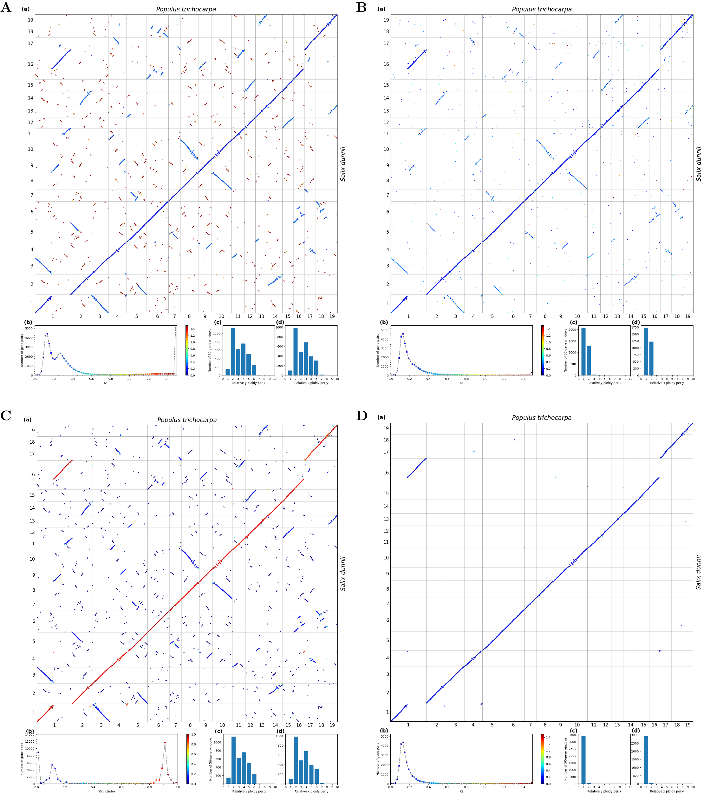

[](https://github.com/zhangrengang/soi/actions/workflows/main-linux.yml)
[](https://github.com/zhangrengang/soi/actions/workflows/main-mac.yml)

## Table of Contents

   * [Quick start](#Quick-start)
   * [Introduction](#introduction)
   * [Installation](#Installation)
      - [conda](#conda)
      - [Apptainer/Singularity](#apptainersingularity)
   * [Subcommands](#Subcommands)
      * Visualization
        - [dotplot](#dotplot)
        - [depth](#depth)
        - [retention](#retention)
        - [ksplot](#ksplot)
        - [evaluate](#evaluate)
      * Syntenic Orthogroups
        - [filter](#filter)
        - [cluster](#cluster)
        - [outgroup](#outgroup)
        - [detandem](#detandem)
      * Hierarchical Orthologous Groups
        - [hog](#hog)
        - [paralog](#paralog)
        - [prune](#prune)
      * Phylogenomics
        - [phylo](#phylo)
   * [Other functions](#other-functions)
      - [Macro-synteny phylogeny](#Macro-synteny-phylogeny)
	  - [Allele identification](#Allele-identification)
   * [Phylogenomics pipeline](#Phylogenomics-pipeline)
   * [Grid Computing](#Grid-Computing)
   * [Input formats](#input-formats)
   * [Output formats](#output-formats)
   * [Citation](#citation)
## Quick start ##
```
git clone https://github.com/zhangrengang/orthoindex.git
cd orthoindex

# install
conda env create -f OrthoIndex.yaml
conda activate OrthoIndex
pip3 install .

# test
cd example_data/
sh example.sh

# example.sh:
# dot plots
# A
soi dotplot -s Populus_trichocarpa-Salix_dunnii.collinearity.gz \
        -g Populus_trichocarpa-Salix_dunnii.gff.gz -c Populus_trichocarpa-Salix_dunnii.ctl  \
        --kaks Populus_trichocarpa-Salix_dunnii.collinearity.ks.gz \
        --xlabel 'Populus trichocarpa' --ylabel 'Salix dunnii' \
        --ks-hist --max-ks 1.5 -o Populus_trichocarpa-Salix_dunnii     \
        --plot-ploidy --gene-axis --number-plots
# B
soi dotplot -s Populus_trichocarpa-Salix_dunnii.orthologs.gz    \
        -g Populus_trichocarpa-Salix_dunnii.gff.gz -c Populus_trichocarpa-Salix_dunnii.ctl  \
        --kaks Populus_trichocarpa-Salix_dunnii.collinearity.ks.gz \
        --xlabel 'Populus trichocarpa' --ylabel 'Salix dunnii'  \
        --ks-hist --max-ks 1.5 -o Populus_trichocarpa-Salix_dunnii.o   \
        --plot-ploidy --gene-axis --number-plots  \
              # homology input
# C
soi dotplot -s Populus_trichocarpa-Salix_dunnii.collinearity.gz \
        -g Populus_trichocarpa-Salix_dunnii.gff.gz -c Populus_trichocarpa-Salix_dunnii.ctl  \
        --xlabel 'Populus trichocarpa' --ylabel 'Salix dunnii' \
        --ks-hist -o Populus_trichocarpa-Salix_dunnii.io    \
        --plot-ploidy --gene-axis --number-plots \
        --ofdir OrthoFinder/OrthoFinder/Results_*/ --of-color   # coloring by Orthology Index
# D
soi dotplot -s Populus_trichocarpa-Salix_dunnii.collinearity.gz \
        -g Populus_trichocarpa-Salix_dunnii.gff.gz -c Populus_trichocarpa-Salix_dunnii.ctl  \
        --kaks Populus_trichocarpa-Salix_dunnii.collinearity.ks.gz \
        --xlabel 'Populus trichocarpa' --ylabel 'Salix dunnii' \
        --ks-hist --max-ks 1.5 -o Populus_trichocarpa-Salix_dunnii.io  \
        --plot-ploidy --gene-axis --number-plots \
        --ofdir OrthoFinder/OrthoFinder/Results_*/ --of-ratio 0.6       # filtering by Orthology Index


# filter orthologous synteny
soi filter -s Populus_trichocarpa-Salix_dunnii.collinearity.gz -o OrthoFinder/OrthoFinder/Results_*/ \
        -c 0.6 > Populus_trichocarpa-Salix_dunnii.collinearity.ortho.test
# or (alter input format)
soi filter -s Populus_trichocarpa-Salix_dunnii.collinearity.gz -o Populus_trichocarpa-Salix_dunnii.orthologs.gz \
        -c 0.6 > Populus_trichocarpa-Salix_dunnii.collinearity.ortho.test
# compare with the expected output: no output via `diff`
diff Populus_trichocarpa-Salix_dunnii.collinearity.ortho Populus_trichocarpa-Salix_dunnii.collinearity.ortho.test

```
**Note**: If you want to run the [full phylogenomics pipeline of SOI](https://github.com/zhangrengang/evolution_example/), 
GENE ID is needed to label with SPECIES ID (e.g. `Angelica_sinensis|AS01G00001`) for compatibility.
See [details how to prepare the data](https://github.com/zhangrengang/evolution_example/?tab=readme-ov-file#prepare-data).
Anyway, the GENE/CHROMOSOME IDs in the input files are at least required to be consistent and unique.

### Example output dot plots ###

**Figure.** The Orthology Index in identifying orthologous synteny: a typical case. 

**A**) Ks-colored dot plots showing synteny detected by WGDI, 
with an observable distinction of three categories of syntenic blocks derived from three evolutionary events 
(three peaks: Ks ≈ 1.5, Ks ≈ 0.27, and Ks ≈ 0.13). 

**B**) Ks-colored dot plots illustrating orthology inferred by OrthoFinder2, with an observable high proportion of hidden out-paralogs (Ks ≈ 0.27). 

**C**) Orthology Index (OI)-colored dot plots: integrating synteny (A) and orthology (B), 
with polarized and scalable distinction of three categories of syntenic blocks 
(three peaks: OI ≈ 0, OI ≈ 0.1, and OI ≈ 0.9). 

**D**) Ks-colored dot plots of synteny after applying an OI cutoff of 0.6, 
with clean 1:1 orthology as expected from the evolutionary history. 

A-D are plotted using the `dotplot` subcommand with four subplots: 

**a**) dot plots with colored by Ks or OI (x-axis and y-axis, chromosomes of the two genomes; 
a dot indicates a homologous gene pair between the two genomes), 

**b**) histogram (with the same color map as the dot plots) of Ks or OI 
(x-axis, Ks or OI; y-axis, number of homologous gene pairs), 

**c-d**) synteny depth (orthologous synteny depth indicating relative ploidy) derived from 50-gene windows (x-axis, synteny depth; y-axis, number of windows).

## Introduction ##
Orthology Index (OrthoIndex or OI) incorporates algorithmic advances of two methods (orthology inference and synteny detection), to determine the orthology of a syntenic block. 
It is straightforward, representing the proportion of orthologous gene pairs within a syntenic block. 

## Installation ##
#### conda ####
You can install the environment and the lasest verion using [conda](https://anaconda.org/) or [mamba](https://github.com/mamba-org/mamba):
```
git clone https://github.com/zhangrengang/orthoindex.git
cd orthoindex

mamba env create -f OrthoIndex.yaml
mamba activate OrthoIndex
pip3 install .
soi -h
```
Sometimes, `OrthoIndex.yaml` may be failed due to conflicts. You can install the dependencies as below:
```
mamba install python=3.8.8 -y -n orthoindex 
mamba install -y -n orthoindex biopython networkx lazy-property drmaa psutil matplotlib \
			mafft trimal 'iqtree>=2' newick_utils pal2nal mcl muscle \
			wgdi orthofinder aster
mamba activate orthoindex
pip3 install .
soi -h
```

Alternatviely, the released version can be installed through [conda](https://anaconda.org/) or [mamba](https://github.com/mamba-org/mamba):
```
mamba create -n OrthoIndex
mamba install -n OrthoIndex -c conda-forge -c bioconda soi
mamba activate OrthoIndex
soi -h
```
#### Apptainer/Singularity ####
To use the container, you need to have installed [Apptainer](https://apptainer.org/docs/user/latest/index.html) or 
[Singularity](https://sylabs.io/docs/). 
Then you can download the container image and run:
```
apptainer remote add --no-login SylabsCloud cloud.sylabs.io
apptainer remote use SylabsCloud
apptainer pull orthoindex.sif library://shang-hongyun/collection/orthoindex:1.2.0
./orthoindex.sif soi -h
```
The image can be found [here](https://cloud.sylabs.io/library/shang-hongyun/collection/orthoindex).

## Subcommands ##

### Visualization ###

#### `dotplot` ####
The subcommand `dotplot` enables visualization and evaluation of synteny, 
with colored by the Orthology Index or Ks values, or subgenome/ancestor assignments.

Usage examples:
```
# basic dotplot with Ks coloring (gene-axis is default)
soi dotplot -s collinearity.ortho -g all.gff -c xy_chrs.ctl --kaks wgdi_ks.tsv -o dot_ks

# use base-pair coordinates instead
soi dotplot -s collinearity.ortho -g all.gff -c xy_chrs.ctl --kaks wgdi_ks.tsv --bp-axis -o dot_bp

# color by Orthology Index (takes priority over Ks)
soi dotplot -s collinearity.ortho -g all.gff -c xy_chrs.ctl -orth orthologs.txt --of-color --of-ratio 0.6 -o dot_oi

# with ploidy subplots (a-d panels)
soi dotplot -s collinearity.ortho -g all.gff -c xy_chrs.ctl --kaks wgdi_ks.tsv --ks-hist --plot-ploidy --number-plots -o dot_full

# specify chromosomes directly (no ctl file)
soi dotplot -s collinearity.ortho -g all.gff --xchrs Pt1 Pt2 --ychrs Sd3 Sd4 -o dot_chrs

# auto-detect chromosomes by species name from GFF
soi dotplot -s collinearity.ortho -g all.gff --xsp Vitis_vinifera --ysp Daucus_carota -o dot_sp

# ancestor chromosome bars (--xbars triggers bar, data from --xanc)
soi dotplot -s collinearity.ortho -g all.gff -c xy_chrs.ctl --xanc anc_x.txt --xbars --xbarlab -o dot_bar

# bars with explicit file (no need for --xanc when not coloring dots)
soi dotplot -s collinearity.ortho -g all.gff -c xy_chrs.ctl --xbars alt_anc.txt -o dot_bar_file

# color bars by subgenome; dots by subgenome (y axis)
soi dotplot -s collinearity.ortho -g all.gff -c xy_chrs.ctl --yanc anc_y.txt --colorby-sg y --ybars --bar-colorby-sg -o dot_sg

# color dots by ancestor colors (from ancestor file color column)
soi dotplot -s collinearity.ortho -g all.gff -c xy_chrs.ctl --xanc anc_x.txt --colorby-anc x -o dot_anc_color

# custom subgenome colors for bars and dots
soi dotplot -s collinearity.ortho -g all.gff -c xy_chrs.ctl --xanc anc_x.txt --xbars --bar-colorby-sg --sg-colors '#FF0000' '#00FF00' '#0000FF' '#FFFF00' -o dot_custom
```

#### `depth` ####
The subcommand `depth` enables visualization of synteny depth (window-based),
with one genome as the reference.

Usage examples:
```
# specify multiple queries:
soi depth -s collinearity.ortho -g ../all_species_gene.gff -r Vitis_vinifera -q Daucus_carota Angelica_sinensis Apium_graveolens

# specify window size and step:
soi depth -s collinearity.ortho -g ../all_species_gene.gff -r Vitis_vinifera -q Daucus_carota Angelica_sinensis Apium_graveolens --window_size 60 --window_step 1

```

#### `retention` ####
The subcommand `retention` computes gene retention rate (syntenic genes / total genes)
along chromosomes of a reference genome using a sliding window, comparing multiple
query species overlaid in different colours.

Usage examples:
```
# basic: one reference vs multiple queries
soi retention -s collinearity.ortho -g all.gff -r Vitis_vinifera -q Daucus_carota Angelica_sinensis

# custom window size and step
soi retention -s collinearity.ortho -g all.gff -r Vitis_vinifera -q Daucus_carota Angelica_sinensis --window_size 100 --window_step 5

# restrict denominator to a subset of genes (e.g. only protein-coding)
soi retention -s collinearity.ortho -g all.gff -r Vitis_vinifera -q Daucus_carota --include coding_genes.txt

# exclude certain genes from denominator (e.g. TEs)
soi retention -s collinearity.ortho -g all.gff -r Vitis_vinifera -q Daucus_carota --exclude te_genes.txt

# plot specific chromosomes only
soi retention -s collinearity.ortho -g all.gff -r Vitis_vinifera -q Daucus_carota --chrs Chr1 Chr2 Chr3

# count duplicates (for WGD query species, retention may exceed 1)
soi retention -s collinearity.ortho -g all.gff -r Vitis_vinifera -q Daucus_carota --count-duplicates

```

The output is a single-column step plot (one row per chromosome) with shared y-axis.
Multiple query species are overlaid in different colours with a legend showing overall
retention rate per species.  A stats file (`<prefix>.stats.tsv`) lists per-query
syntenic gene count, total gene count, and overall retention.

#### `ksplot` ####
The subcommand `ksplot` plots Ks distributions with three visualization types:
histogram, density curve, and ridge plot.

Usage examples:
```
# histogram + density + ridge plots (default)
soi ksplot --kaks wgdi_ks.tsv

# histogram only, with custom max Ks
soi ksplot --kaks wgdi_ks.tsv -p hist --max-ks 1.5
```

#### `evaluate` ####
The subcommand `evaluate` generates multi-panel diagnostic plots to evaluate and compare synteny patterns,
including fractionation rate, block size decay, Orthology Index, and copy-number statistics.

Usage examples:
```
# basic evaluation
soi evaluate -s collinearity.ortho -o orthologs.txt -g all.gff -r Vitis_vinifera -pre eval

# filter by query species
soi evaluate -s collinearity.ortho -o orthologs.txt -g all.gff -r Vitis_vinifera -q Daucus_carota Angelica_sinensis

```

### Syntenic Orthogroups ###

#### `filter` ####
The subcommand `filter` filters orthologous blocks with a default minimum index of 0.6:

Usage examples:
```
# from outputs of WGDI and OrthoFinder
soi filter -s wgdi/*.collinearity -o OrthoFinder/OrthoFinder/Result*/ > collinearity.ortho

# from outputs of MCscanX and OrthoMCL
soi filter -s mcscanx/*.collinearity -o pairs/orthologs.txt > collinearity.ortho

# from a list file and decrease the cutoff
ls wgdi/*.collinearity > collinearity.list
soi filter -s collinearity.list -o OrthoFinder/OrthoFinder/Result*/ -c 0.5 > collinearity.ortho

# filter a out-paralogous peak
soi filter -s wgdi/*.collinearity -o OrthoFinder/OrthoFinder/Result*/ -c 0.05 -upper 0.4 > collinearity.para

# remove intra-species, tandem repeat-derived synteny (in-paralogous)
soi filter -s wgdi/*.collinearity -o OrthoFinder/OrthoFinder/Result*/ -gff all_species_gene.gff -d 200 > collinearity.homo

# It can also distinguish in-paralogous from out-paralogous synteny split by a given speciation event, 
# if we provide in-paralogs instead of orthologs
soi filter -s wgdi/SP1-SP1.collinearity -o inparalogs.pairs > collinearity.inpara

```
#### `cluster` ####
The subcommand 'cluster' groups orthologous syntenic genes into syntenic orthogroups (SOGs), through constructing an orthologous syntenic graph 
and applying the Markov Cluster (MCL) algorithm to perform graph clustering and break weak links. 

Usage examples:
```
# all species to include
soi cluster -s collinearity.ortho -prefix cluster

# exclude outgroup species that do not share the INGROUP-specific WGD event
soi cluster -s collinearity.ortho -outgroup XXX YYY
```
The defualt output file is `cluster.mcl`, with the orthogroup format of legacy OrthoMCL.

#### `outgroup` ####
The subcommand 'outgroup' retrieves syntenic orthologs from outgroups that lack WGDs shared with ingroups. 

Usage examples:
```
# If outgroups are excluded in the last `cluster` step:
soi outgroup -s collinearity.ortho -og cluster.mcl -outgroup XXX YYY > cluster.mcl.plus
```

#### `detandem` ####
The subcommand `detandem` removes tandem duplicate genes from orthogroups.
Tandem duplicates are defined as genes on the same chromosome whose index difference
is below a threshold (default `-d 200`). When synteny files (`-s`) are provided,
the gene with the highest degree in the synteny graph is retained;
otherwise, one gene is chosen arbitrarily.

Usage examples:
```
# basic tandem removal
soi detandem -og cluster.mcl -g all_species_gene.gff > cluster.mcl.detandem

# with custom distance threshold
soi detandem -og cluster.mcl -g all_species_gene.gff -d 100 > cluster.mcl.detandem

# with synteny files for smarter gene retention
soi detandem -og cluster.mcl -g all_species_gene.gff -s collinearity.ortho > cluster.mcl.detandem
```

### Hierarchical Orthologous Groups ###

#### `hog` ####
The subcommand `hog` splits orthogroups into Hierarchical Orthologous Groups (HOGs)
based on orthologous synteny, and can output copy-number statistics for detecting
whole-genome duplications (WGD) across the species tree.

Usage examples:
```
# basic HOG splitting
soi hog -og cluster.mcl -s collinearity.ortho -t species.tree -prefix HOGs

# output copy-number statistics table (per-node distribution)
soi hog -og cluster.mcl -s collinearity.ortho -t species.tree -prefix HOGs --out-stats

# bar chart of copy-number distribution per node
soi hog -og cluster.mcl -s collinearity.ortho -t species.tree -prefix HOGs --bar-plot

# species tree with pie charts at nodes (gray=1 copy, blue=2, green=3, orange=4, red=5+)
soi hog -og cluster.mcl -s collinearity.ortho -t species.tree -prefix HOGs --tree-plot

# all outputs combined
soi hog -og cluster.mcl -s collinearity.ortho -t species.tree -prefix HOGs --out-stats --bar-plot --tree-plot --max-copies 10
```

Output files:
- `HOGs.tsv` — HOG table (HOG / OG / Tree_Node / Parent / Genes)
- `HOGs.stats.tsv` — per-node copy-number distribution (columns: 1, 2, 3, ..., N+, Multi%)
- `HOGs.bar.pdf/.png` — multi-panel bar chart of the distribution
- `HOGs.tree.pdf/.png` — species tree with pie charts at each node

#### `paralog` ####
The subcommand `paralog` outputs HOG-based paralogous gene pairs per branch
and classifies synteny blocks by branch-specific paralog content (Paralogue Index, PI).

Usage examples:
```
# basic: output paralog pairs per branch
soi paralog -og cluster.mcl -s collinearity.ortho -t species.tree -pre paralog

# classify synteny blocks by branch paralog content (default mode)
# uses -ss (self-synteny, default same as -s) for block assignment
soi paralog -og cluster.mcl -s collinearity.ortho -t species.tree \
    -ss self.collinearity.list -pre paralog

# filter by specific branches or species
soi paralog -og cluster.mcl -s collinearity.ortho -t species.tree \
    -pre paralog --nodes N1 N10 --species Arabidopsis_thaliana

# raw paralog output only (disable index mode)
soi paralog -og cluster.mcl -s collinearity.ortho -t species.tree \
    --no-index -pre paralog
```

Output files:
- `<prefix>.paralog.tsv` — paralog pairs (gene1, gene2, node, species, HOG_id)
- `<prefix>.stats.tsv` — per-branch per-species block statistics (blocks, gene_pairs, paralog_pairs, mean_PI)
- `<prefix>.{branch}.blocks` — synteny blocks assigned to each branch

Index mode (default): for each self-synteny block, compute PI = (paralog pairs / gene pairs)
per branch and assign to the branch with the highest PI.  Blocks with PI below --pi-cutoff
(0.05) fall back to the root node.

Filter options (shared with `hog` and `paralog`):
- `--min-child-species N` — skip child HOGs with fewer than N species (default: 1).  Useful for suppressing orphan single-species HOGs that inflate Multi% at branches without WGD.
- `--cross-speciation` — do not split child HOGs when the genes at a node do not span all child branches.  **Note:** genes that fail to cross the speciation boundary are inherently ambiguous — keeping them unsplit can shift duplication signal from this node down to a child branch.
- `--drop-no-cross` — drop (instead of merge) entire nodes whose genes do not span all child branches.  **Note:** this can break the HOG parent-child chain: a HOG at node N may have its parent dropped at N's parent, leaving `Parent` as a dead reference and causing internal nodes' copy-number statistics and paralog detection to miss these edges.  Use with caution.

#### `prune` ####
The subcommand `prune` purifies orthogroups (OGs) to single-copy per species,
guided by Hierarchical Orthologous Group (HOG) information.
For each SOG, it traverses the species tree and keeps only the gene copy
from the HOG with the broadest species representation, removing the rest.

Usage examples:
```
# basic pruning
soi prune -og cluster.mcl -s collinearity.ortho -t species.tree -o cluster.sc.mcl
```

### Phylogenomics ###

#### `phylo` ####
The subcommand ‘phylo’ reconstructs multi-copy or single-copy gene trees, 
by aligning protein sequences with MAFFT v7.481 (Standley and Katoh 2013), 
converting protein alignment to codon alignment with PAL2NAL v14 (Suyama et al. 2006), 
trimming alignments with trimAl v1.2 (Capella-Gutierrez et al. 2009) (parameter: -automated1) 
and reconstructing maximum-likelihood trees with IQ-TREE v2.2.0.3 (Minh et al. 2020). 

Usage examples:
```
# output multi-copy gene trees of both protein and CDS(-both); rooted with grape (-root)
soi phylo -og cluster.mcl.plus -pep pep.faa -cds cds.fa -both -root Vitis_vinifera -pre mc-sog -p 80

# output single-copy gene trees (-sc) and concatenated alignments (-concat) of both protein and CDS (-both); rooted with grape (-root)
soi phylo -og cluster.mcl.plus -pep pep.faa -cds cds.fa -both -root Vitis_vinifera -pre sc-sog -sc -concat -p 80

# output multi-copy gene trees of protein, allowing up to 50% taxa missing
soi phylo -og cluster.mcl.plus -pep pep.faa -mm 0.5
```

### Other functions ###
Other functions can be found in [SOI-tools](SOI-tools.md). Related functions can be requested by users via [issues](https://github.com/zhangrengang/SOI/issues).
#### Macro-synteny phylogeny ####
See [the function](SOI-tools.md#macro-synteny-phylogeny).
#### Allele identification ####
See [the function](SOI-tools.md#Allele-identification).

### Phylogenomics pipeline ###

See [evolution_example](https://github.com/zhangrengang/evolution_example/) for a pipeline of phylogenomics analyses based on Orthology Index.

### Grid Computing ###
The `phylo` subcommand supports SGE (Sun Grid Engine) and SLURM for parallelizing gene tree reconstruction tasks. 
However, it requires the DRMAA to be properly configured (see [DRMAA Python](https://github.com/pygridtools/drmaa-python)). 
After `libdrmaa` is installed, just set the DRMAA_LIBRARY_PATH environment variable, like:
```
export DRMAA_LIBRARY_PATH=/opt/gridengine/lib/lx-amd64/libdrmaa.so.1.0
```

### Input formats ###

#### Synteny format ####
All the output format of state-of-the-art synteny detectors, including [JCVI](https://github.com/tanghaibao/jcvi), 
[MCscanX](http://chibba.pgml.uga.edu/mcscan2) and [WGDI](https://github.com/SunPengChuan/wgdi), are supported:
```
# WGDI -icl (*.collinearity):
# Alignment 1: score=3194 pvalue=0.0265 N=80 Dc1&Lj1 plus
Daucus_carota|DCAR_003996 3506 Lonicera_japonica|Lj1C1189G6 4566 -1
Daucus_carota|DCAR_004004 3514 Lonicera_japonica|Lj1P1192T21 4580 1
Daucus_carota|DCAR_004005 3515 Lonicera_japonica|Lj1P1192T26 4581 1
.....

# MCscanX (*.collinearity):
############### Parameters ###############
# MATCH_SCORE: 50
# ....
## Alignment 28: score=500.0 e_value=1.3e-24 N=11 Ac1&Ah1 plus
 28-  0:        Ananas_comosus|Aco009515.1      Arabidopsis_thaliana|AT1G72340        0
 28-  1:        Ananas_comosus|Aco009511.1      Arabidopsis_thaliana|AT1G72360        0
 28-  2:        Ananas_comosus|Aco009507.1      Arabidopsis_thaliana|AT1G72370        0
 28-  3:        Ananas_comosus|Aco009502.1      Arabidopsis_thaliana|AT1G72410        0
 28-  4:        Ananas_comosus|Aco009492.1      Arabidopsis_thaliana|AT1G72480        0
.....

# JCVI (*.anchors):
###
Tetracendron_sinense|Tesin01G0059600    Trochodendron_aralioides|evm.TU.group9.733      1780
Tetracendron_sinense|Tesin01G0060100    Trochodendron_aralioides|evm.TU.group9.725      334
Tetracendron_sinense|Tesin01G0060800    Trochodendron_aralioides|evm.TU.group9.710      868
Tetracendron_sinense|Tesin01G0061600    Trochodendron_aralioides|evm.TU.group9.757      294
Tetracendron_sinense|Tesin01G0062600    Trochodendron_aralioides|evm.TU.group9.777      1400
....

```

#### Orthology format ####
The outputs from [OrthoFinder2](https://github.com/davidemms/OrthoFinder), 
[OrthoMCL](https://docs.google.com/document/d/1RB-SqCjBmcpNq-YbOYdFxotHGuU7RK_wqxqDAMjyP_w/pub), 
[Proteinortho6](https://gitlab.com/paulklemm_PHD/proteinortho), 
[Broccoli](https://github.com/rderelle/Broccoli), 
[InParanoid](https://bitbucket.org/sonnhammergroup/inparanoid/src/master/),
[SonicParanoid2](https://gitlab.com/salvo981/sonicparanoid2) are supported:
```
# OrthoFinder2 output directory like:
OrthoFinder/OrthoFinder/Results_Jun25/

# OrthoMCL:
Tetracendron_sinense|Tesin01G0059600    Trochodendron_aralioides|evm.TU.group9.733      ...
Tetracendron_sinense|Tesin01G0060100    Trochodendron_aralioides|evm.TU.group9.725      
Tetracendron_sinense|Tesin01G0060800    Trochodendron_aralioides|evm.TU.group9.710
...

# SonicParanoid2 output directory via `-o sonicparanoid_output --project-id my_run`:
sonicparanoid_output/runs/my_run/

# InParanoid output directory via `-out-dir ip-output -out-table`:
ip-output/
# or InParanoid output ortholog file via `-out-dir ip-output -out-allPairs`:
ip-output/allPairs

# Proteinortho6 output ortholog file:
*.proteinortho-graph

# Broccoli output ortholog file:
dir_step4/orthologous_pairs.txt

```

#### Gene coordinate format ####
The gff/bed format for JCVI, MCscanX and WGDI are supported:
```
# gff for WGDI:
Dc1     Daucus_carota|DCAR_000504       20809   26333   +       1       Daucus_carota|DCAR_000504
Dc1     Daucus_carota|DCAR_000505       30205   39120   +       2       Daucus_carota|DCAR_000505
Dc1     Daucus_carota|DCAR_000506       53069   54763   +       3       Daucus_carota|DCAR_000506
Dc1     Daucus_carota|DCAR_000507       56557   60502   -       4       Daucus_carota|DCAR_000507
....

# gff for MCscanX:
Dc1     Daucus_carota|DCAR_000504       20809   26333   
Dc1     Daucus_carota|DCAR_000505       30205   39120   
Dc1     Daucus_carota|DCAR_000506       53069   54763   
Dc1     Daucus_carota|DCAR_000507       56557   60502   
....

# bed for JCVI:
Dc1       20809   26333     Daucus_carota|DCAR_000504   0	+
Dc1       30205   39120     Daucus_carota|DCAR_000505	0	+
Dc1       53069   54763     Daucus_carota|DCAR_000506	0	+
....
```

**Note:** SOI re-orders genes by the start coordinate column internally,
so GFF files do not need to be pre-sorted.
However, **WGDI call-synteny (`-icl`)** uses the gene-index column
(e.g. the `1,2,3,4` column in WGDI GFF format) directly without
re-sorting; incorrect index values will produce scrambled synteny blocks.

#### Ks table format ####
The outputs from [KaKsCalculator](https://sourceforge.net/projects/kakscalculator2/) and WGDI are supported:
```
# KaKsCalculator:
Sequence        Method  Ka      Ks      Ka/Ks   P-Value(Fisher) Length  S-Sites N-Sites Fold-Sites(0:2:4)       Substitutions   S-Substitutions N-Substitutions Fold-S-Substitutions(0:2:4)      Fold-N-Substitutions(0:2:4)     Divergence-Time Substitution-Rate-Ratio(rTC:rAG:rTA:rCG:rTG:rCA/rCA)    GC(1:2:3)       ML-Score        AICc    Akaike-Weight   Model
Arabidopsis_thaliana|AT1G29430-Oryza_sativa|LOC_Os09g37470      YN      0.650185        3.49784 0.185882        3.0186e-10      420     106.037 313.963 NA      218     82.1279 135.872 NA       NA      1.36913 2.07932:2.07932:1:1:1:1 0.477381(0.467857:0.428571:0.535714)    NA      NA      NA      NA
Arabidopsis_thaliana|AT1G29440-Oryza_sativa|LOC_Os09g37420      YN      0.541299        3.27405 0.16533 3.75171e-12     330     78.6813 251.319 NA      161     64.364  96.636  NA      NA       1.19287 1.62285:1.62285:1:1:1:1 0.468182(0.431818:0.459091:0.513636)    NA      NA      NA      NA
Arabidopsis_thaliana|AT1G29460-Oryza_sativa|LOC_Os09g37410      YN      0.60446 3.48369 0.173511        1.7716e-11      408     104.055 303.945 NA      207     81.5585 125.441 NA      NA       1.33877 2.28955:2.28955:1:1:1:1 0.470588(0.452206:0.419118:0.540441)    NA      NA      NA      NA
....

# WGDI -ks:
id1     id2     ka_NG86 ks_NG86 ka_YN00 ks_YN00
Angelica_sinensis|AS08G00315    Daucus_carota|DCAR_007041       0.0685  0.3645  0.0717  0.328
Angelica_sinensis|AS01G00334    Daucus_carota|DCAR_027727       0.0871  0.4938  0.0815  0.8313
Angelica_sinensis|ASUnG00186    Daucus_carota|DCAR_004673       0.1858  0.5447  0.1871  0.5516
....

```
#### Chromosome config format ####
The ctl format for MCscanX (dot_plotter) is supported:
```
1500
1500
As1,As2,As3,As4,As5,As6,As7,As8,As9,As10,As11	// y axis
Dc1,Dc2,Dc3,Dc4,Dc5,Dc6,Dc7,Dc8,Dc9				// x axis
```

#### Ancestor file format ####
The ancestor file (WGDI `ancestor.txt` format) maps modern chromosomes to ancestral chromosome blocks.
Used by `--xanc`, `--yanc`, `--xbars`, `--ybars`, `--colorby-sg`, `--colorby-anc`, and `--bar-colorby-sg`.
Format: `chrom  start  end  color  subgenome  [label]`

```
# basic format (5 columns):
Pt1   0     100   #FF0000  1
Pt1   100   250   #00B9F1  2
Pt2   0     80    #FF0000  1
Pt2   80    200   #7200DA  3

# extended format (6 columns, label for --xbarlab / --ybarlab):
Pt1   0     100   #FF0000  1   Anc1A
Pt1   100   250   #00B9F1  2   Anc1B
Pt2   0     80    #FF0000  1   Anc2A
Pt2   80    200   #7200DA  3   Anc2B
```

Columns: `chrom` (modern chromosome), `start`/`end` (gene-order coordinates), `color` (hex color for ancestor chromosome), `subgenome` (integer subgenome ID), `label` (optional, shown when `--xbarlab`/`--ybarlab` is set).

In summary, users may be not needed to preprare additional files for this tool.
#### Species tree format ####
The Newick format (with or without branch lengths and support values) is supported for `hog` and `rak` subcommands:
```
# simple Newick with species names only:
(Vitis_vinifera,(Daucus_carota,(Angelica_sinensis,Apium_graveolens)));

# with branch lengths:
(Vitis_vinifera:0.1,(Daucus_carota:0.05,(Angelica_sinensis:0.02,Apium_graveolens:0.02):0.03):0.05);

# with WGD indicator (p=2: tetraploidy, p=3: hexaploidy, etc.):
(Vitis_vinifera:0.1,(Daucus_carota:0.05,(Angelica_sinensis:0.02,Apium_graveolens:0.02):0.03)[p=2]:0.05);
```

In summary, users may be not needed to preprare additional files for this tool. And other popular format can be supported upon request.
But it is **important** to label GENE ID with SPECIES ID (e.g. `Angelica_sinensis|AS01G00001`) (see details in [evolution_example](https://github.com/zhangrengang/evolution_example/)). 
Unique CHROMOSOME ID is also required.
It is the best to make all ID unique when preparing your data,
so that many issues will be avoided, not only in `soi` but also in other tools.

### Output formats ###

#### Synteny format ####
The output fommat is just the same as the [input format](#input-formats).

#### Orthogroup format ####
The output format of `cluster` and `outgroup` subcommands is the same as the OrthoMCL output format (legacy format):
```
SOG3000: Angelica_sinensis|AS08G01493 Angelica_sinensis|AS09G02085 Apium_graveolens|Ag7G00949 Aralia_elata|AE10G00968 Centella_asiatica|evm.TU.Scaffold_1.3269 Coriandrum_sativum|Cs09G02292 Coriandrum_sativum|Cs09G02294 Daucus_carota|DCAR_003880 Daucus_carota|DCAR_007867 Eleutherococcus_senticosus|Ese12G000172 Panax_ginseng|GWHGBEIL036624.1 Panax_ginseng|GWHGBEIL065014.1 Panax_notoginseng|PN028370
SOG3001: Angelica_sinensis|AS08G03434 Angelica_sinensis|AS08G03435 Apium_graveolens|Ag6G02640 Aralia_elata|AE12G02374 Centella_asiatica|evm.TU.Scaffold_7.2677 Coriandrum_sativum|Cs09G00377 Daucus_carota|DCAR_001654 Eleutherococcus_senticosus|Ese19G002246 Panax_ginseng|GWHGBEIL023685.1 Panax_ginseng|GWHGBEIL043114.1 Panax_ginseng|GWHGBEIL043118.1 Panax_ginseng|GWHGBEIL043125.1 Panax_notoginseng|PN013450
SOG3002: Angelica_sinensis|AS10G01791 Apium_graveolens|Ag1G00857 Apium_graveolens|Ag6G02641 Aralia_elata|AE12G02379 Centella_asiatica|evm.TU.Scaffold_7.2680 Coriandrum_sativum|Cs06G01941 Coriandrum_sativum|Cs06G01943 Coriandrum_sativum|Cs09G00381 Daucus_carota|DCAR_001660 Daucus_carota|DCAR_029095 Panax_ginseng|GWHGBEIL023683.1 Panax_ginseng|GWHGBEIL043112.1 Panax_notoginseng|PN013453
...
```

#### HOG format ####
The `hog` subcommand outputs a TSV file with hierarchical orthologous group information:
```
HOG	OG	Tree_Node	Parent	Genes
SOG100.N5.hog0	SOG100	N5	Root	Sp1|G001 Sp1|G002 Sp2|G003
SOG100.N3.hog0	SOG100	N3	SOG100.N5.hog0	Sp1|G001 Sp2|G003
SOG100.N3.hog1	SOG100	N3	SOG100.N5.hog0	Sp1|G002
```
Columns: `HOG` (unique HOG ID), `OG` (source orthogroup), `Tree_Node` (species tree node), `Parent` (parent HOG or "Root" if at root), `Genes` (space-separated gene IDs).

## Citation ##
If you use `soi`, please cite:
> Zhang RG, Shang HY, Milne RI et. al. 
SOI: robust identification of orthologous synteny with the Orthology Index and broad applications in evolutionary genomics [J]. 
*Nucleic. Acids. Res.*, 2025, 53 (7):gkaf320 [https://doi.org/10.1093/nar/gkaf320]

If you use `soi depth`, please cite:
> Zhang RG, Lysak MA, Shang HY et. al. Orthologous synteny provides robust structural evidence for the ancestral angiosperm ε-WGD [J]. 
*Mol. Plant.*, 2026 [https://doi.org/10.1016/j.molp.2026.06.006]
